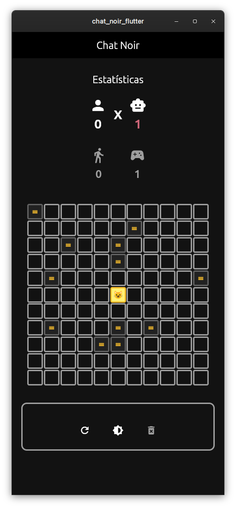

# chat-noir2.0

## Visão Geral

O Chat Noir é um jogo interativo, onde o usuário enfrenta uma inteligência artificial que controla o movimento do gato. O objetivo do jogador é cercar o gato para impedir sua fuga, enquanto a IA tenta escapar do tabuleiro. O jogo utiliza um algoritmo Minimax para determinar a melhor jogada do gato, tornando a experiência desafiadora.

## Demonstração

## Tecnologias utilizadas

## Como Rodar o Projeto
  1. Certifique-se de ter o Flutter instalado (https://flutter.dev).
  2. Clone o repositório do projeto.
  3. Execute `flutter pub` get para instalar dependências.
  4. Rode o app com `flutter run` em um dispositivo ou emulador compatível.

## Equipe do Projeto

| Foto                                                                 | Nome                                            | GitHub                                          |
| -------------------------------------------------------------------- | ----------------------------------------------- | ----------------------------------------------- |
|      | [Clara Dias](https://github.com/claradiass)     | [Perfil GitHub](https://github.com/claradiass)  |
|       | [Aniel Melo](https://github.com/anielmelo)      | [Perfil GitHub](https://github.com/anielmelo)   |
|       | [Hugo Diniz](https://github.com/dinizhugo)      | [Perfil GitHub](https://github.com/dinizhugo)   |
|  | [Guilherme X L](https://github.com/guilhermexL) | [Perfil GitHub](https://github.com/guilhermexL) |
